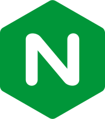

#  Hello friend

   

-   🔭 I’m currently learning **networking** and **pentesting**
-   🔬 Learn more about me on [my website](https://stefano.pages.io)

---

###  Toolbox

<a href="https://www.python.org/">
    
<a href="https://www.pygame.org/"
    
</a>

<a href="https://unity.com/
    
</a>

<a href="https://cloud.google.com/"
    
</a>

  
---

 ~ Stefano 

